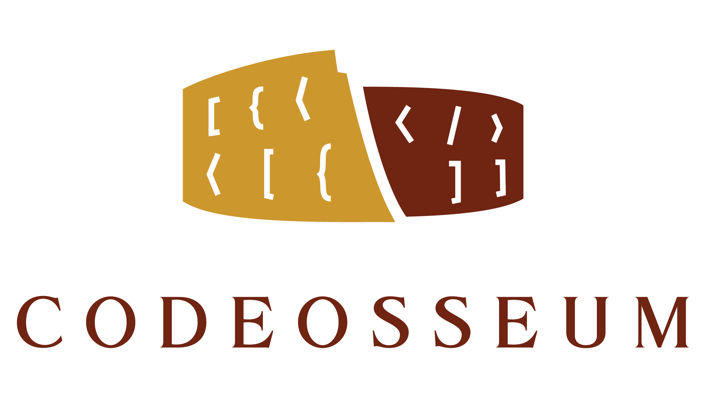

  

Eligo: Simple matchmaking library in Java.

# Eligo

Eligo is a customizable matchmaking library, written in Java 8.

Supported matchmakers:

  * Decision Tree
    * Support for any Player and Match type.
    * An extensible set of classifier nodes.
    * Custom match function.

## Example

### Decision Tree

Let's assume, that we want to setup a decision tree based matchmaking with the following properties:

  * Match
    * Two teams.
    * Each team consists of two players:
      * attacker,
      * defender.
  * Player
    * Ranks from 0 to 50.
    * Players can choose whether they want to be attackers or defenders.

First, let's create some predicates to decide what role a player wants to play.

~~~~Java
Predicate<Player> isAttacker = player -> Role.ATTACKER.equals(player.role);
Predicate<Player> isDefender = player -> Role.DEFENDER.equals(player.role);
~~~~

Now, we can create a match function. Match functions are executed against the so-called buckets which are the leaf nodes of the decision trees, collecting similar players. A match function consists of two parts:

  * **Predicate**: Decides, whether the match function is applicable to the bucket.
  * **Supplier**: Actually creates a new match by picking players from the bucket.

The predicate in this case is pretty simple: we need 2 attackers and 2 defenders if we want to create a new match.

If the predicate is fulfilled, we simply pick an attacker and a defender for each team.

Note, that Eligo is fully generic, you can use your own Player and Match types.

~~~~Java
MatchFunction<Player, Match> matchFunction = MatchFunction.<Player, Match>builder()
  .predicate(hasAtLeast(Match.TEAMS, isAttacker).and(hasAtLeast(Match.TEAMS, isDefender)))
  .supplier(picker -> {
      List<Team> teams = IntStream.range(0, Match.TEAMS)
        .mapToObj(i -> new Team(picker.pickSingle(isAttacker), picker.pickSingle(isDefender)))
        .collect(Collectors.toList());

      return new Match(teams);
  })
  .build();
~~~~

Let's continue with a classifier! We want to classify players based on their ranks, so that only players on the same level of experience will be matched. This can be done using an interval classifier as follows:

~~~~Java
List<Integer> rankSegments = asList(10, 20, 30, 40);

Classifier<Player> rankClassifier = Classifiers.openInterval(rankSegments, Player::getRank);
~~~~

The last step of the preparation is to actually create the matchmaker using the parts previously set up:

~~~~ Java
Matchmaker<Player, Match> matchmaker = Matchmakers.<Player, Match>decisionTree()
  .classifier(rankClassifier)
  .matchFunction(matchFunction)
  .build();
~~~~

Now we can easily make matches among any number of players:

~~~~Java
List<Player> players = asList(
        new Player("Fred", Role.ATTACKER, 5),
        new Player("Julia", Role.ATTACKER, 6),
        new Player("Emily", Role.DEFENDER, 7),
        new Player("Jon", Role.DEFENDER, 4)
);

players.forEach(matchmaker::addPlayer);

Set<Match> matches = matchmaker.makeMatch();
~~~~

## Install

### Maven

First, you have to set up the Codeosseum Bintray repository:

~~~~XML
<repository>
    <snapshots>
        <enabled>false</enabled>
    </snapshots>
    <id>bintray-codeosseum-repo</id>
    <name>bintray</name>
    <url>https://dl.bintray.com/codeosseum/repo</url>
</repository>
~~~~

Then, you can add Eligo as a dependency:

~~~~XML
<dependency>
    <groupId>com.codeosseum</groupId>
    <artifactId>eligo</artifactId>
    <version>0.2.0</version>
</dependency>
~~~~

### Gradle

Same for Gradle, first the appropriate repository:

~~~~Groovy
repositories { 
  maven { 
    url "https://dl.bintray.com/codeosseum/repo"
  }
} 
~~~~

And afterwards, the dependency:

~~~~Groovy
implementation 'com.codeosseum:eligo:0.2.0'
~~~~

## License

Eligo is licensed under the [Apache License 2.0](LICENSE).

## Acknowledgements

  

    Supported by the ÚNKP-18-2 New National Excellence Program of the Ministry of Human Capacities.

